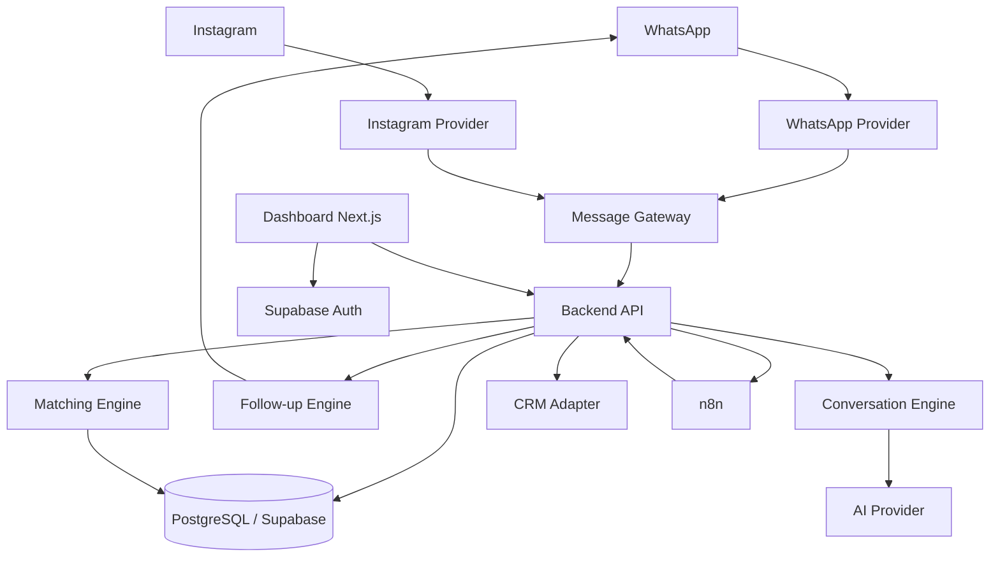

# Plano Mestre — SaaS Imobiliário com IA, CRM Conversacional e Follow-up

> **Versão 2.0 — 14/08/2026**
>
> Versão evoluída para execução real, governada por etapas fechadas e orientada à criação de um produto proprietário, não genérico.
>
> Objetivo: começar validando com um corretor real, resolver a dor de excesso de atendimento em WhatsApp/Instagram e, desde a fundação, evitar decisões que impeçam a evolução para um SaaS multi-tenant vendido para corretores e imobiliárias.

---

# 0. Regras Invioláveis de Execução do Plano

Estas regras possuem precedência operacional sobre qualquer instrução de implementação presente nas etapas seguintes.

O objetivo é impedir execução apressada, perda de contexto, regressões silenciosas e avanço para uma nova etapa antes de a anterior estar realmente encerrada.

---

## 0.1 O plano é obrigatoriamente dividido em ETAPAS

A unidade oficial de execução deste projeto é:

```text
ETAPA
```

Cada etapa deverá possuir, no mínimo:

```text
objetivo
escopo
pré-requisitos
entregáveis
arquivos/módulos esperados
não objetivos
riscos
testes obrigatórios
Definition of Done
revisão final
mini-relatório
STOP GATE
```

Não trabalhar em várias etapas simultaneamente para “ganhar tempo”.

Se uma necessidade futura for descoberta durante uma etapa:

1. registrar;
2. classificar;
3. adicionar à `memoria.md`;
4. não implementá-la silenciosamente caso pertença a outra etapa.

---

## 0.2 Nunca avançar automaticamente

**REGRA ABSOLUTA: nenhuma IA, agente ou desenvolvedor automatizado está autorizado a iniciar a próxima etapa automaticamente.**

Ao concluir uma etapa:

```text
PARAR
```

Mesmo que:

- ainda haja contexto disponível;
- a próxima etapa pareça simples;
- os testes tenham passado;
- o agente saiba exatamente o que fazer;
- seja possível continuar na mesma sessão.

O agente deverá finalizar com:

```text
ETAPA X CONCLUÍDA
STATUS: AGUARDANDO AUTORIZAÇÃO PARA A PRÓXIMA ETAPA
```

A próxima etapa só pode começar após autorização explícita do responsável pelo projeto.

Exemplos de autorização válida:

```text
Aprovado
Pode avançar
Vamos para a próxima
Etapa concluída, continue
Feito
```

Ausência de resposta **não é autorização**.

---

## 0.3 Nenhum código da próxima etapa pode ser “adiantado”

É proibido:

- criar tabelas de uma etapa futura “para aproveitar”;
- instalar dependências futuras sem necessidade atual;
- construir componentes ocultos;
- criar endpoints futuros;
- preparar workflows não aprovados;
- implementar features fora do escopo “porque já estamos mexendo nisso”.

Preparar uma abstração já aprovada pela arquitetura é permitido.

Implementar funcionalidade futura, não.

---

## 0.4 Revisão obrigatória ao final de cada etapa

Ao terminar a implementação, ainda **não considerar a etapa concluída**.

Executar uma revisão integral do código trabalhado.

Escopo mínimo da revisão:

```text
todos os arquivos alterados
todos os arquivos criados
migrations da etapa
testes da etapa
configurações alteradas
dependências adicionadas
interfaces públicas alteradas
módulos diretamente impactados
integrações tocadas
```

Também revisar as superfícies diretamente conectadas ao código alterado para detectar regressões.

---

## 0.5 Revisão em duas passagens

### Passagem A — Verificação funcional

Revisar:

- implementação versus objetivo;
- requisitos;
- comportamento esperado;
- edge cases;
- erros;
- estados vazios;
- estados de loading;
- estados de falha;
- persistência;
- integração.

### Passagem B — Revisão adversarial

Tentar quebrar o que foi construído.

Procurar especificamente:

```text
regressão
race condition
duplicação
falha de idempotência
vazamento entre tenants
autorização incorreta
segredo exposto
falha de retry
loop
estado impossível
dados órfãos
migration irreversível
provider lock-in
dependência indevida do n8n
ação de IA não confirmada
follow-up indevido
quebra de compatibilidade
dívida técnica introduzida
feature futura vazando para a etapa atual
```

A revisão não deve ser uma formalidade.

Se um problema for encontrado:

1. corrigir;
2. repetir os testes afetados;
3. revisar novamente;
4. somente depois gerar o mini-relatório.

---

## 0.6 Validação técnica obrigatória

Quando aplicável, rodar:

```text
lint
typecheck
unit tests
integration tests
E2E relevante
build
migration tests
security checks
smoke test
```

Uma etapa com teste falhando não pode ser marcada como concluída.

Não apagar, enfraquecer ou ignorar teste apenas para obter status verde.

---

## 0.7 Mini-relatório obrigatório ao final de cada etapa

Toda etapa termina com um relatório curto, objetivo e permanente.

Formato obrigatório:

```markdown
# Mini-relatório — Etapa X

## Status

CONCLUÍDA / BLOQUEADA / CONCLUÍDA COM PENDÊNCIAS

## Objetivo da etapa

...

## O que foi implementado

- ...

## Arquivos e módulos principais alterados

- ...

## Banco / migrations

- ...

## Testes executados

- comando
- resultado

## Revisão de segurança e multi-tenancy

- ...

## Bugs encontrados durante a revisão

- ...

## Bugs corrigidos

- ...

## Pendências registradas

- ...

## Riscos conhecidos

- ...

## Dívida técnica criada

Nenhuma / descrição

## Métricas ou evidências

- ...

## Próxima etapa prevista

Etapa X+1 — NOME

## Modelo / esforço recomendado para a próxima etapa

...

## STOP GATE

AGUARDANDO AUTORIZAÇÃO DO RESPONSÁVEL.
```

Salvar, preferencialmente, em:

```text
docs/relatorios/etapa-XX.md
```

E registrar um resumo em:

```text
memoria.md
```

---

## 0.8 O mini-relatório não autoriza continuidade

Após gerar o relatório:

**PARAR A EXECUÇÃO.**

Não:

- abrir a implementação da etapa seguinte;
- modificar código da próxima etapa;
- “só preparar” a próxima feature;
- iniciar pesquisa técnica específica da próxima etapa como parte do build.

Pode apenas indicar o que será necessário depois.

---

## 0.9 Revisão do plano antes de cada nova etapa

Quando o usuário autorizar a próxima etapa:

1. reler `CLAUDE.md` ou `GEMINI.md`;
2. reler `memoria.md`;
3. reler o trecho relevante deste Plano Mestre;
4. verificar Git;
5. verificar o estado atual;
6. ler o mini-relatório da etapa anterior;
7. confirmar pré-requisitos;
8. só então implementar.

---

## 0.10 Regra de sincronização documental

Ao final de uma etapa relevante, manter coerentes:

```text
Plano Mestre
CLAUDE.md
GEMINI.md
memoria.md
README.md
migrations
testes
mini-relatório
```

O Plano Mestre não precisa ser reescrito a cada commit.

Mas uma decisão arquitetural nova aprovada deve ser registrada.

---

## 0.11 Filosofia de execução

A velocidade desejada é:

> rápida por etapa, rigorosa na transição.

Não queremos:

> um agente fazendo vinte coisas e descobrindo no final que as cinco primeiras estavam erradas.

Queremos:

```text
construir
↓
provar
↓
revisar
↓
documentar
↓
parar
↓
aprovar
↓
continuar
```

---

## 0.12 Regra máxima de exclusividade

Este projeto **não será tratado como template de CRM, dashboard genérico ou clone de concorrente**.

Toda decisão relevante deverá responder:

```text
Isso poderia estar em qualquer SaaS?
```

Se a resposta for “sim”, avaliar como torná-la específica para a operação imobiliária e para nossa tese de produto.

Exclusividade não significa reinventar tecnologias maduras.

Não criaremos:

- banco proprietário apenas para ser diferente;
- framework próprio sem necessidade;
- criptografia própria;
- fila própria;
- componente inacessível para parecer inovador.

Usaremos tecnologias maduras na infraestrutura.

A exclusividade deverá estar principalmente em:

```text
modelo de domínio
inteligência
dados
workflows
UX
design system
motores proprietários
automação
métricas
experiência comercial
forma como oportunidades são descobertas
```

# 1. Missão do Produto

Construir uma plataforma de atendimento e vendas para o mercado imobiliário que:

1. centralize leads vindos de WhatsApp e Instagram;
2. responda e qualifique automaticamente;
3. organize cada lead em um funil;
4. identifique intenção, urgência e qualidade;
5. execute follow-ups automaticamente;
6. sugira imóveis compatíveis;
7. permita o corretor assumir a conversa a qualquer momento;
8. registre visitas, propostas, perdas e fechamentos;
9. sincronize dados importantes com o CRM já utilizado pela imobiliária;
10. transforme conversas em dados e dados em oportunidades comerciais;
11. funcione primeiro para um corretor;
12. evolua sem reescrita para equipes e imobiliárias.

O produto não deve ser criado como “um bot”.

Ele deve ser criado como um **sistema operacional comercial para corretores**, no qual IA e automações são componentes internos.

---

# 2. Cenário Inicial Confirmado

## Cliente zero

O primeiro usuário real será um corretor que já possui demanda relevante.

### Canais principais

- WhatsApp.
- Instagram.

### Operação atual

- A imobiliária já possui CRM.
- O novo sistema não deve tentar substituir esse CRM no primeiro momento.
- O novo produto deve atuar antes e durante o atendimento, eliminando tarefas manuais e enviando para o CRM apenas informações úteis.

### Negócio

Prioridade:

1. locação;
2. venda.

### Orçamento inicial

A arquitetura deve privilegiar componentes gratuitos, self-hosted ou de baixo custo, sem comprometer a capacidade futura de escalar.

### Objetivo empresarial

Validar com o primeiro corretor e transformar a solução em SaaS multi-tenant para:

- corretores autônomos;
- equipes;
- imobiliárias;
- gestores comerciais.

---

# 3. Mudanças Fundamentais em Relação ao Plano Antigo

Estas mudanças devem ser consideradas obrigatórias.

## 3.1 Não construir o produto inteiro dentro do n8n

O n8n será utilizado para:

- integrações auxiliares;
- tarefas operacionais;
- rotinas administrativas;
- gatilhos;
- sincronizações;
- prototipação de workflows;
- notificações internas.

O n8n **não será a fonte oficial de estado do negócio**.

Não deixar armazenado apenas dentro de workflows:

- estágio do lead;
- lógica de qualificação;
- regras de follow-up;
- permissões;
- isolamento multi-tenant;
- histórico;
- lead scoring;
- bloqueios;
- auditoria;
- consentimentos;
- regras de roteamento.

Essas responsabilidades devem ficar no backend + PostgreSQL.

---

## 3.2 Criar uma camada de canais

Não acoplar o sistema diretamente à Evolution API.

Criar uma interface conceitual:

```ts
interface MessagingProvider {
  sendText(input: SendTextInput): Promise<SendResult>;
  sendTemplate(input: SendTemplateInput): Promise<SendResult>;
  sendMedia(input: SendMediaInput): Promise<SendResult>;
  normalizeInbound(payload: unknown): NormalizedMessage;
  getDeliveryStatus(payload: unknown): DeliveryStatus;
}
```

Implementações futuras:

```text
MessagingProvider
├── EvolutionWhatsAppProvider
├── MetaWhatsAppCloudProvider
└── InstagramMessagingProvider
```

Consequência:

Se o MVP começar com Evolution API e posteriormente migrar para Cloud API oficial, o domínio do sistema não deverá ser refeito.

---

## 3.3 Separar WhatsApp e Instagram

São canais diferentes.

Não assumir que o mesmo conector tratará os dois.

Arquitetura:

```text
WhatsApp
   ↓
WhatsApp Adapter
   ↓

Instagram
   ↓
Instagram Adapter
   ↓

Normalized Message Gateway
   ↓
Conversation Engine
```

---

## 3.4 Construir o follow-up como motor, não como cron simples

Não implementar apenas:

```text
todos os dias às 10h
buscar lead parado há 3 dias
mandar mensagem
```

Isso quebra facilmente.

Implementar:

```text
Evento
  ↓
Regra
  ↓
Criação de Follow-up Job
  ↓
Scheduler
  ↓
Validação antes do envio
  ↓
Mensagem
  ↓
Registro
  ↓
Próximo passo
```

Cada tarefa de follow-up deverá poder ser:

- agendada;
- cancelada;
- pausada;
- reprogramada;
- concluída;
- bloqueada;
- auditada.

---

# 4. Visão do Produto

## Proposta de valor

> “Nenhum lead imobiliário é esquecido.”

O produto deve atacar quatro perdas de dinheiro:

### Perda 1 — demora para responder

Lead chega e ninguém responde rapidamente.

### Perda 2 — atendimento desperdiçado

Corretor gasta tempo com perguntas repetitivas e leads ainda sem perfil.

### Perda 3 — ausência de follow-up

Cliente fala:

> “Vou pensar.”

E desaparece do radar.

### Perda 4 — imóvel certo aparece depois

Um imóvel entra ou baixa de preço, mas ninguém lembra de quais leads tinham exatamente aquele perfil.

---

# 5. Produto em Camadas

```text
CAMADA 1 — CAPTAÇÃO
WhatsApp / Instagram / Portais / Landing Pages

CAMADA 2 — CONVERSAÇÃO
IA / FAQ / Qualificação / Handoff Humano

CAMADA 3 — CRM CONVERSACIONAL
Lead / Funil / Histórico / Tarefas / Visitas / Propostas

CAMADA 4 — FOLLOW-UP
Sequências / Eventos / Reativação / Pós-visita / Novos imóveis

CAMADA 5 — INTELIGÊNCIA
Lead Score / Match de imóveis / Alertas / Resumo / Insights

CAMADA 6 — GESTÃO
Dashboard / Equipe / Distribuição / Métricas / Conversão

CAMADA 7 — SAAS
Multi-tenant / Billing / Planos / Permissões / Onboarding
```

---

# 5A. DNA Exclusivo do Produto

A partir desta versão, “ficar bonito” ou “ter IA” não é suficiente.

O SaaS deverá possuir uma linguagem própria reconhecível mesmo se o logotipo estiver oculto.

Nome interno da direção de produto e interface:

```text
SIGNAL ROOM
```

Esse é um codinome de design, não o nome comercial definitivo.

A ideia:

> transformar ruído de atendimento em sinais claros de receita.

---

## 5A.1 Princípio visual

Não criar:

```text
sidebar genérica
6 cards de KPI
gráfico de linha
tabela
botão roxo de IA
```

como identidade do produto.

A interface deverá parecer um **centro operacional de oportunidades imobiliárias**.

Características:

- alta clareza;
- densidade controlada;
- hierarquia forte;
- pouco ruído;
- sinais de ação evidentes;
- IA integrada à operação, não em um chat isolado;
- foco em “o que exige atenção agora”.

---

## 5A.2 Arquitetura visual principal

Desktop:

```text
┌─────────┬───────────────────────────────────┬─────────────────────┐
│         │                                   │                     │
│ COMMAND │          WORKSPACE                │ INTELLIGENCE RAIL   │
│  RAIL   │                                   │                     │
│         │                                   │                     │
└─────────┴───────────────────────────────────┴─────────────────────┘
```

### Command Rail

Largura-base:

```text
68px
```

Função:

- navegação;
- troca de módulo;
- alertas críticos;
- identidade visual;
- acesso rápido.

Não usar uma sidebar permanentemente cheia de texto quando o contexto puder ser entendido por ícone + tooltip + expansão controlada.

### Workspace

Área principal.

Muda de acordo com:

```text
Radar
Lead
Inbox
Funil
Visitas
Imóveis
Follow-up
```

### Intelligence Rail

Painel contextual lateral.

Largura de referência:

```text
360px
```

Exibe apenas inteligência relacionada ao objeto aberto.

Exemplo em um lead:

```text
temperatura
por que está quente
próxima melhor ação
riscos
preferências
matches
follow-up futuro
resumo
```

Essa terceira coluna é uma assinatura do produto.

Não mostrar painel de IA vazio por padrão.

---

## 5A.3 Navegação

Módulos principais:

```text
Radar
Leads
Inbox
Pipeline
Follow-ups
Visitas
Imóveis
Equipe
Insights
Integrações
Configurações
```

`Radar` substitui a ideia de uma Home genérica.

---

## 5A.4 Tipografia

### Interface

```text
Plus Jakarta Sans Variable
```

Uso:

- navegação;
- botões;
- tabelas;
- textos;
- títulos;
- formulários.

Razões:

- geometria contemporânea;
- leitura excelente;
- personalidade suficiente sem sacrificar densidade de CRM;
- variável;
- open source.

### Dados e sinais

```text
IBM Plex Mono
```

Uso restrito:

- horários;
- valores curtos;
- IDs técnicos quando visíveis;
- score;
- delta;
- timestamps;
- pequenos indicadores operacionais.

Não usar mono em parágrafos.

### Futuro site comercial

Pode utilizar:

```text
Instrument Serif
```

apenas para headlines editoriais e branding, nunca para a interface operacional principal.

---

## 5A.5 Paleta v1 — Signal Room

### Estrutura

```text
Ink           #10141A
Canvas        #F4F1EA
Surface       #FFFFFF
Text          #18202A
Text Muted    #626C77
Line          #D9DAD6
```

### Assinatura

```text
Signal Mint   #66E0B4
```

Uso:

- oportunidade;
- atividade inteligente;
- confirmação;
- elementos assinatura;
- foco sobre superfícies escuras.

Contraste de `Signal Mint` sobre `Ink` foi calculado em aproximadamente:

```text
11.33:1
```

### Inteligência / ação

```text
Electric      #5B7CFF
```

Uso:

- camada de inteligência;
- automação;
- ações assistidas.

Não utilizar Electric como texto pequeno sobre branco.

### Atenção

```text
Copper        #C66A3D
```

Uso:

- atenção comercial;
- follow-up próximo;
- oportunidade envelhecendo.

### Erro

Definir token semântico acessível na implementação e validar contraste antes de aprovação.

---

## 5A.6 Regra de cor

A cor não serve para decorar.

Cada cor possui semântica.

Proibido:

- rainbow dashboard;
- cada card com uma cor;
- gradiente neon gratuito;
- roxo genérico para “IA”;
- cor de status sem texto/ícone complementar.

---

## 5A.7 Componentes assinatura

Construir progressivamente, apenas quando chegarem às etapas correspondentes.

### Opportunity Pulse

Barra compacta indicando:

```text
qualidade
urgência
recência
movimento
```

Não é apenas um badge “QUENTE”.

---

### Context Rail

Painel lateral da Intelligence Rail.

Responde:

```text
o que sei?
o que mudou?
o que falta?
qual o risco?
qual o próximo movimento?
```

---

### Timeline Ribbon

Timeline comercial contínua do lead.

Mistura:

```text
mensagens
ações
visitas
mudanças
matches
follow-ups
handoffs
```

com linguagem visual única.

---

### Action Sheet

Quando a IA quiser executar algo sensível:

```text
ação
motivo
dados usados
consequência
aprovar
editar
cancelar
```

Evitar caixa modal genérica.

---

### Match Matrix

Visualiza:

```text
Lead → Imóveis
```

e futuramente:

```text
Imóvel → Leads
```

com razões explícitas de compatibilidade.

---

### Recovery Card

Mostra uma oportunidade recuperada:

```text
lead estava dormente
evento que reacendeu
mensagem enviada
resposta
valor potencial
próximo passo
```

Esse card deverá conectar automação a receita.

---

## 5A.8 Motion

Movimento:

```text
140–180 ms
```

para microinterações comuns.

Usar:

- opacity;
- transform;
- expansão contextual.

Evitar:

- animação ornamental;
- bouncing;
- efeitos que atrasem atendimento;
- loaders longos quando skeleton resolve.

Respeitar:

```text
prefers-reduced-motion
```

---

## 5A.9 Ícones

Criar um pequeno conjunto proprietário de ícones para módulos centrais:

```text
Radar
Lead
Pulse
Match
Recover
Visit
Signal
Automation
```

Grid:

```text
20x20
```

Traço:

```text
1.75px
```

Utilitários secundários podem usar biblioteca madura durante o MVP.

Os ícones de navegação e recursos assinatura não devem depender para sempre de um pacote genérico sem adaptação.

---

## 5A.10 Layout de dados

Não esconder informação operacional atrás de cards enormes.

Preferir:

- listas densas;
- agrupamentos;
- linhas de contexto;
- indicadores compactos;
- ações inline;
- disclosure progressivo.

Desktop é o ambiente prioritário da operação.

Mobile deverá permitir:

- consultar;
- responder;
- assumir lead;
- ver próxima ação;
- registrar visita;

sem tentar reproduzir toda a densidade do desktop.

---

# 5B. Tecnologias Proprietárias do Produto

“Proprietária” aqui significa **motor e lógica desenvolvidos dentro do nosso produto**, mesmo utilizando infraestrutura open source.

Não significa reinventar Postgres ou IA generativa.

Codinomes internos:

---

## 5B.1 SignalGraph

Camada de relações do negócio.

Conecta:

```text
Lead
Conversation
Message
Property
Preference
Objection
Visit
Follow-up
Agent
Outcome
Event
```

Inicialmente pode ser implementada sobre PostgreSQL.

Não adicionar graph database sem necessidade comprovada.

Objetivo:

> entender oportunidade como uma rede de fatos e eventos, não como uma linha em uma tabela.

---

## 5B.2 Pulse Engine

Motor de priorização operacional.

Entrada:

```text
recência
intenção
completude
respostas
visitas
matches
objeções
mudanças de imóvel
eventos
follow-ups
tempo parado
```

Saída:

```text
priority_score
priority_reason[]
next_best_action
confidence
expires_at
```

A interface nunca deve mostrar apenas:

```text
Score 82
```

Deve explicar:

```text
Por que agora?
```

---

## 5B.3 Recover Engine

Motor de recuperação de leads esquecidos.

Busca oportunidades dormentes quando algo muda:

```text
novo imóvel
redução de preço
mudança de disponibilidade
nova condição
lead volta a interagir
visita cancelada
fim de período de espera
```

O sistema deve medir receita/visita originada de recuperação.

---

## 5B.4 MatchLoop

Matching bidirecional.

Modo A:

```text
Tenho um lead → quais imóveis servem?
```

Modo B:

```text
Tenho um imóvel novo → quais leads podem comprar/alugar?
```

Modo C — diferencial futuro:

```text
Tenho muita demanda sem imóvel → que tipo de imóvel minha operação deveria captar?
```

O Modo C transforma atendimento em inteligência de estoque.

---

## 5B.5 Demand Radar

Agrega demanda não atendida de forma não individualizante para o gestor.

Exemplo:

```text
32 leads ativos
buscam:
2 dormitórios
Eloy Chaves
até R$ 3.200
1 vaga

estoque compatível:
2 imóveis
```

Saída:

```text
DEMANDA DESCOBERTA
OPORTUNIDADE DE CAPTAÇÃO
```

Isso cria valor além do CRM.

O produto começa a dizer à imobiliária:

> não apenas quem atender, mas que estoque buscar.

---

## 5B.6 GuardRail Engine

Motor de autorização para ações automáticas.

Classifica ações:

```text
LOW_RISK
MEDIUM_RISK
HIGH_RISK
```

Exemplos:

### LOW_RISK

- salvar resumo;
- atualizar preferência;
- criar tarefa.

Pode executar automaticamente.

### MEDIUM_RISK

- enviar determinado follow-up;
- sugerir visita;
- alterar etapa.

Depende de configuração.

### HIGH_RISK

- negociar preço;
- confirmar obrigação;
- cancelar algo relevante;
- enviar comunicação sensível;
- alterar condição comercial.

Exige humano.

---

## 5B.7 Replay Lab

Ambiente de simulação de automações.

Antes de ativar uma mudança:

```text
nova regra
novo prompt
novo modelo
nova sequência
```

rodar contra:

```text
fixtures
conversas anonimizadas autorizadas
cenários sintéticos controlados
```

Mostrar:

```text
o que teria acontecido
quantas mensagens
quantos handoffs
quantos erros
quais leads seriam impactados
```

Objetivo:

> não testar comportamento de receita diretamente em cliente real quando pudermos simular antes.

---

## 5B.8 Revenue Attribution

Toda automação importante deverá buscar atribuição.

Exemplo:

```text
Recover Engine
↓
lead respondeu
↓
visita criada
↓
proposta
↓
WON
```

Dashboard deverá conseguir mostrar futuramente:

```text
R$ potencial recuperado
visitas recuperadas
negócios influenciados
```

Cuidado:

não afirmar causalidade absoluta quando houver apenas correlação.

Usar conceitos:

```text
originado por
assistido por
influenciado por
```

---

## 5B.9 Next Best Move

Em vez de obrigar o corretor a navegar em filtros, o sistema deverá gerar uma fila priorizada:

```text
Faça agora
Faça hoje
Pode esperar
Automação cuidando
```

Cada item deve explicar:

```text
AÇÃO
POR QUÊ
CONTEXTO
PRAZO
RESULTADO ESPERADO
```

Isso deve ser parte central do `Radar`.

---

## 5B.10 Opportunity Memory

Memória estruturada da relação comercial.

Não é “memória do chatbot”.

É um conjunto rastreável de fatos:

```text
preferências
mudanças de preferência
objeções
imóveis vistos
motivos de rejeição
prazos
visitas
respostas
eventos
```

O sistema deverá saber que:

> o lead recusou três imóveis por falta de vaga

sem depender de o LLM reler milhares de tokens toda vez.

---

# 5C. Regra de Produto Não Genérico

Antes de aprovar uma feature de interface, perguntar:

```text
Qual problema imobiliário específico isso resolve?
```

Antes de aprovar uma automação:

```text
Qual evento comercial dispara isso?
```

Antes de aprovar uma métrica:

```text
Qual decisão o corretor ou gestor toma com ela?
```

Antes de aprovar IA:

```text
Que tarefa concreta melhora e como mediremos?
```

Antes de aprovar um componente:

```text
Ele representa nosso modelo operacional ou é só decoração de dashboard?
```

Se não houver resposta boa:

não construir.

# 6. Escopo do MVP Real

O MVP deve resolver muito bem uma operação.

Não construir tudo de uma vez.

## MVP obrigatório

### Atendimento

- receber WhatsApp;
- identificar contato;
- registrar mensagem;
- gerar resposta;
- salvar resposta;
- enviar resposta;
- histórico completo.

### Qualificação

Locação:

- finalidade;
- cidade;
- bairro/região;
- tipo do imóvel;
- valor máximo;
- dormitórios;
- vagas;
- pet, quando relevante;
- data ou urgência para mudança;
- garantia locatícia;
- observações importantes.

Venda:

- cidade;
- bairro/região;
- tipo do imóvel;
- valor máximo;
- dormitórios;
- vagas;
- financiamento ou forma de compra, quando o próprio lead trouxer o assunto;
- prazo;
- observações.

### CRM interno

- lista de leads;
- busca;
- filtros;
- estágio;
- responsável;
- temperatura;
- última interação;
- próxima ação;
- timeline.

### Handoff humano

Botão:

> Assumir conversa

Ao assumir:

```text
automation_mode = HUMAN
```

A IA não envia novas respostas automáticas.

Botão:

> Reativar IA

Retorna:

```text
automation_mode = AI
```

### Follow-up

Implementar inicialmente:

- lead sem resposta;
- lead qualificado sem avanço;
- pós-visita;
- lead perdido por timing;
- novo imóvel compatível.

### Painel

- novos leads;
- qualificados;
- leads quentes;
- visitas;
- propostas;
- fechados;
- leads sem resposta;
- follow-ups de hoje.

---

# 7. Fora do MVP

Não construir inicialmente:

- ERP imobiliário completo;
- financeiro completo;
- contratos;
- assinatura eletrônica própria;
- gestão de aluguel;
- emissão fiscal;
- aplicativo nativo;
- marketplace;
- portal imobiliário próprio;
- substituição total do CRM existente;
- IA que negocia valores sem supervisão;
- sistema de documentos jurídicos automatizados;
- microserviços complexos;
- Kubernetes.

---

# 8. Arquitetura Técnica

## Stack sugerida

### Frontend

```text
Next.js
TypeScript
Tailwind CSS
componentes acessíveis
```

### Backend

```text
Node.js
TypeScript
Fastify
Zod
```

### Banco

```text
Supabase
PostgreSQL
```

### Autenticação

```text
Supabase Auth
```

### Automação

```text
n8n self-hosted
```

### Mensageria

MVP:

```text
Evolution API
```

Desde o início, usar o adapter descrito anteriormente.

Produção comercial:

```text
Meta WhatsApp Cloud API
```

ou Evolution configurada com provider oficial, caso isso faça sentido operacionalmente.

### Instagram

Usar integração oficial da plataforma Meta para contas profissionais.

### IA

Criar provider abstrato:

```ts
interface AIProvider {
  classifyLead(...): Promise<LeadClassification>;
  extractLeadProfile(...): Promise<LeadProfile>;
  generateReply(...): Promise<GeneratedReply>;
  summarizeConversation(...): Promise<ConversationSummary>;
}
```

Não espalhar chamadas diretas de um fornecedor pelo código inteiro.

### Infra

```text
Docker
Docker Compose
Reverse proxy
HTTPS
GitHub
CI/CD
```

---

# 9. Arquitetura Geral



---

# 10. Regra de Ouro de Arquitetura

## Banco é a fonte da verdade

A verdade não pode depender de:

- memória da IA;
- workflow ativo no n8n;
- histórico do WhatsApp;
- cache local;
- navegador.

Tudo importante deve possuir registro persistente.

---

# 11. Estrutura do Repositório

Recomendação de monorepo:

```text
realestate-ai/
│
├── apps/
│   ├── web/
│   └── api/
│
├── workers/
│   └── followup-worker/
│
├── packages/
│   ├── domain/
│   ├── database/
│   ├── ai/
│   ├── messaging/
│   ├── crm/
│   ├── validation/
│   └── shared/
│
├── supabase/
│   ├── migrations/
│   └── seed/
│
├── n8n/
│   └── workflows/
│
├── infra/
│   ├── docker/
│   └── compose/
│
├── docs/
│
├── .env.example
└── README.md
```

---

# 12. Multi-tenant Desde o Primeiro Commit

Mesmo com apenas um cliente.

Criar:

```text
tenant
```

Exemplo:

```text
tenant_id = abrylar
```

Depois:

```text
tenant_id = imobiliaria_xyz
tenant_id = corretor_joao
tenant_id = imobiliaria_abc
```

Toda entidade comercial relevante deve possuir:

```text
tenant_id
```

---

# 13. Papéis de Usuário

```text
OWNER
MANAGER
AGENT
VIEWER
```

## OWNER

- configura conta;
- gerencia cobrança;
- integra canais;
- gerencia equipe;
- vê tudo.

## MANAGER

- vê equipe;
- distribui leads;
- vê indicadores;
- altera automações autorizadas.

## AGENT

- vê leads permitidos;
- conversa;
- agenda visita;
- muda etapas;
- cria tarefas.

## VIEWER

- somente leitura.

---

# 14. Modelo de Dados

## 14.1 tenants

```text
id
name
slug
status
timezone
created_at
updated_at
```

---

## 14.2 profiles

```text
id
auth_user_id
name
email
phone
created_at
```

---

## 14.3 tenant_members

```text
id
tenant_id
profile_id
role
status
created_at
```

---

## 14.4 channel_connections

```text
id
tenant_id
channel
provider
external_account_id
display_name
status
credentials_reference
settings_json
created_at
updated_at
```

Nunca armazenar credenciais sensíveis em texto puro acessível ao frontend.

---

## 14.5 leads

```text
id
tenant_id
assigned_user_id
name
phone
instagram_user_id
email
source
intent
stage
temperature
score
automation_mode
first_contact_at
last_inbound_at
last_outbound_at
next_action_at
lost_reason
created_at
updated_at
```

---

## 14.6 lead_profiles

```text
id
tenant_id
lead_id

transaction_type
property_type
city
neighborhoods
min_budget
max_budget
bedrooms
bathrooms
parking_spaces
pet_required
move_date
rental_guarantee
financing_interest

qualification_complete
qualification_confidence

structured_preferences_json

created_at
updated_at
```

---

## 14.7 conversations

```text
id
tenant_id
lead_id
channel
provider
external_conversation_id
status
assigned_user_id
automation_mode
last_message_at
created_at
updated_at
```

---

## 14.8 messages

```text
id
tenant_id
conversation_id
lead_id
external_message_id
direction
sender_type
message_type
text
media_url
provider_status
ai_generated
ai_run_id
sent_at
delivered_at
read_at
created_at
```

Criar restrição de idempotência para impedir que o mesmo webhook gere duas mensagens.

---

## 14.9 lead_stage_history

```text
id
tenant_id
lead_id
from_stage
to_stage
changed_by_type
changed_by_id
reason
created_at
```

---

## 14.10 activities

```text
id
tenant_id
lead_id
type
title
description
scheduled_for
completed_at
created_by
created_at
```

Exemplos:

```text
CALL
VISIT
FOLLOW_UP
NOTE
PROPOSAL
DOCUMENT
OTHER
```

---

## 14.11 visits

```text
id
tenant_id
lead_id
property_id
assigned_user_id
scheduled_at
status
feedback
created_at
updated_at
```

---

## 14.12 properties

No MVP pode ser importado.

```text
id
tenant_id
external_id
title
transaction_type
property_type
city
neighborhood
price
condo_fee
bedrooms
bathrooms
parking_spaces
pets_allowed
rental_guarantees_json
status
url
main_image_url
metadata_json
created_at
updated_at
```

---

## 14.13 property_matches

```text
id
tenant_id
lead_id
property_id
score
reasons_json
status
created_at
```

---

## 14.14 followup_sequences

```text
id
tenant_id
name
trigger_type
status
channel
created_at
updated_at
```

---

## 14.15 followup_steps

```text
id
tenant_id
sequence_id
position
delay_value
delay_unit
message_strategy
template_id
stop_conditions_json
created_at
```

---

## 14.16 followup_jobs

```text
id
tenant_id
lead_id
conversation_id
sequence_id
step_id

scheduled_at
status
attempts

cancel_reason
blocked_reason

provider_message_id

locked_at
locked_by

created_at
updated_at
executed_at
```

Status:

```text
PENDING
PROCESSING
SENT
CANCELLED
BLOCKED
FAILED
```

---

## 14.17 consent_preferences

```text
id
tenant_id
lead_id
channel
marketing_allowed
followup_allowed
opted_out
opted_out_at
source
created_at
updated_at
```

---

## 14.18 ai_runs

```text
id
tenant_id
lead_id
conversation_id
purpose
provider
model
input_tokens
output_tokens
latency_ms
confidence
result_json
error
created_at
```

---

## 14.19 integration_syncs

```text
id
tenant_id
integration_type
entity_type
entity_id
external_id
status
payload_hash
last_sync_at
error
created_at
updated_at
```

---

## 14.20 audit_logs

```text
id
tenant_id
actor_type
actor_id
action
entity_type
entity_id
metadata_json
ip
created_at
```

---

# 15. Segurança Multi-tenant

Todas as tabelas expostas ao aplicativo devem possuir políticas de segurança.

Conceito:

```text
usuário autenticado
    ↓
tenant_members
    ↓
tenant_id permitido
    ↓
dados daquele tenant
```

Nunca depender apenas de:

```ts
.where("tenant_id", tenantId)
```

no frontend.

A proteção deverá existir também no banco.

---

# 16. Pipeline de Entrada de Mensagem

```text
Webhook do provider
        ↓
validar assinatura/token
        ↓
normalizar payload
        ↓
checar idempotência
        ↓
identificar tenant
        ↓
identificar canal
        ↓
identificar lead
        ↓
persistir mensagem
        ↓
atualizar last_inbound_at
        ↓
cancelar follow-ups incompatíveis
        ↓
decidir HUMAN ou AI
        ↓
Conversation Engine
```

---

# 17. NormalizedMessage

Todos os canais devem se converter para algo parecido com:

```ts
type NormalizedMessage = {
  tenantId: string;
  provider: string;
  channel: "WHATSAPP" | "INSTAGRAM";
  externalMessageId: string;
  externalConversationId?: string;
  externalUserId: string;

  direction: "INBOUND";

  type: "TEXT" | "IMAGE" | "AUDIO" | "VIDEO" | "DOCUMENT" | "LOCATION" | "REACTION" | "UNKNOWN";

  text?: string;

  timestamp: string;

  rawPayloadReference?: string;
};
```

O restante do sistema não deve precisar saber como o payload original da Meta ou Evolution funciona.

---

# 18. Conversation Engine

O motor de conversa terá quatro responsabilidades distintas.

## 18.1 Intent Classifier

Classificar:

```text
GREETING
RENTAL_SEARCH
PURCHASE_SEARCH
PROPERTY_QUESTION
SCHEDULE_VISIT
RESCHEDULE
CANCEL_VISIT
DOCUMENTATION
PRICE_NEGOTIATION
HUMAN_REQUEST
COMPLAINT
STOP_MESSAGES
OTHER
```

---

## 18.2 Structured Extractor

Extrair fatos.

Exemplo:

```json
{
  "transaction_type": "RENT",
  "city": "Jundiai",
  "neighborhoods": ["Eloy Chaves"],
  "max_budget": 3000,
  "bedrooms": 2,
  "parking_spaces": 1,
  "move_date": null,
  "rental_guarantee": null
}
```

A IA não deve “inventar” campo ausente.

Campo desconhecido:

```json
null
```

---

## 18.3 Next Action Policy

Com base no estado:

```text
O que ainda falta?
```

Exemplo:

Já sabemos:

- locação;
- bairro;
- orçamento.

Falta:

- quartos;
- prazo;
- garantia.

Escolher apenas a próxima pergunta mais útil.

Evitar interrogatório.

---

## 18.4 Response Generator

Recebe:

- mensagem atual;
- contexto;
- fatos conhecidos;
- pergunta escolhida;
- regras;
- imóveis, caso recuperados;
- canal;
- estilo do tenant.

Retorna texto.

---

# 19. Regra de IA

Não utilizar um único prompt gigante fazendo tudo.

Separar:

```text
1. classificar
2. extrair
3. decidir
4. responder
```

Benefícios:

- debugging;
- métricas;
- menor alucinação;
- testes;
- substituição de modelos;
- redução de custo;
- maior previsibilidade.

---

# 20. Guardrails da IA

A IA nunca deve afirmar como fato algo que não veio de fonte confiável do tenant.

Especialmente:

- preço;
- disponibilidade;
- endereço;
- taxas;
- condições;
- documentação;
- garantia;
- regras do imóvel;
- comissão;
- aprovação;
- condição jurídica.

## Regra

Se a informação não estiver disponível:

> encaminhar ao corretor ou dizer que irá confirmar.

Não inventar.

---

# 21. Handoff Automático

Forçar humano quando:

- cliente pede uma pessoa;
- cliente está irritado;
- negociação de valor;
- proposta;
- discussão jurídica;
- dúvida sem base confiável;
- baixa confiança da IA;
- erro repetido;
- interesse muito alto;
- lead está pronto para fechar;
- reclamação.

---

# 22. Lead Score

Não usar IA como única responsável pelo score.

Criar score híbrido.

Exemplo inicial:

```text
+15 informou orçamento
+10 informou região
+10 informou prazo
+10 informou garantia
+20 pediu visita
+20 respondeu nas últimas 2h
+15 selecionou imóvel específico

-10 parou de responder
-20 orçamento incompatível
-20 busca sem prazo
```

Faixas:

```text
0-29   FRIO
30-59  MORNO
60-79  QUENTE
80-100 PRIORIDADE
```

Os pesos deverão ser configuráveis futuramente.

---

# 23. Funil

MVP:

```text
NEW
CONTACTED
QUALIFYING
QUALIFIED
VISIT_SCHEDULED
VISITED
PROPOSAL
WON
LOST
DORMANT
```

Não criar dezenas de estágios inicialmente.

---

# 24. Follow-up Engine

Este será um dos principais diferenciais comerciais.

## Objetivo

Nunca disparar mensagem apenas porque “passou X tempo”.

Antes de cada envio verificar:

```text
lead ainda está ativo?
lead respondeu?
lead foi fechado?
lead pediu para parar?
corretor assumiu?
já existe visita?
mensagem ainda faz sentido?
canal permite envio?
frequência foi excedida?
```

Somente depois enviar.

---

# 25. Eventos de Follow-up

## 25.1 Qualificação interrompida

Evento:

```text
LEAD_STOPPED_DURING_QUALIFICATION
```

Possíveis ações:

```text
T + curto intervalo
T + algumas horas
próximo dia
```

Sempre respeitando a política do canal.

---

## 25.2 Lead qualificado sem visita

```text
LEAD_QUALIFIED_NO_VISIT
```

Mensagem deve tentar mover para:

```text
visita
```

não simplesmente perguntar:

> “Ainda tem interesse?”

---

## 25.3 Pós-visita

Evento:

```text
VISIT_COMPLETED
```

Follow-up:

```text
algumas horas depois
```

Perguntar feedback.

Extrair:

- gostou;
- não gostou;
- objeção;
- preço;
- localização;
- estrutura;
- quer outra opção.

---

## 25.4 Imóvel novo

Evento:

```text
PROPERTY_CREATED
```

Motor:

```text
novo imóvel
   ↓
buscar leads compatíveis
   ↓
score mínimo
   ↓
checar contatos recentes
   ↓
checar opt-out/frequência
   ↓
criar jobs
```

---

## 25.5 Baixa de preço

```text
PROPERTY_PRICE_REDUCED
```

Buscar pessoas que:

- viram o imóvel;
- tinham aquele perfil;
- desistiram por preço;
- salvaram o imóvel.

---

## 25.6 Lead dormindo

```text
LEAD_DORMANT
```

Reativar baseado em contexto real.

Não usar spam genérico.

---

# 26. Stop Conditions Obrigatórias

Uma sequência deverá parar quando:

```text
lead respondeu
lead virou WON
lead virou LOST definitivo
lead pediu para parar
lead foi bloqueado
canal desconectou
corretor cancelou
visita foi marcada
objetivo da sequência foi atingido
```

---

# 27. Limite de Frequência

Criar desde o MVP:

```text
max_followups_per_7_days
max_followups_per_30_days
minimum_interval_between_outbound
```

Evita:

- spam;
- bloqueios;
- experiência ruim;
- reputação ruim do número.

---

# 28. WhatsApp: Regra para Não Criar Dívida Técnica

Mesmo se o piloto utilizar uma conexão baseada em WhatsApp Web, construir o motor considerando as regras da plataforma oficial.

Na integração oficial, mensagens livres são permitidas dentro da janela de atendimento aberta pela interação do usuário; fora dessa janela, comunicações iniciadas pela empresa exigem templates aplicáveis.

Logo, o modelo de dados deve distinguir:

```text
FREEFORM
TEMPLATE
```

E o follow-up deve saber:

```text
customer_service_window_open
```

Não hardcodar um follow-up de 3 dias presumindo que qualquer texto pode ser enviado por qualquer provider.

---

# 29. Estratégia de WhatsApp Recomendada

## Desenvolvimento

Pode ser utilizado:

```text
Evolution API + número de teste
```

Objetivo:

- desenvolver rápido;
- validar webhooks;
- validar conversação;
- validar painel.

## Piloto real

Preferência:

```text
Cloud API oficial
```

ou uma configuração oficial compatível com a arquitetura adotada.

Motivo:

O sistema pretende virar produto comercial.

Não construir a proposta de valor inteira em torno de uma conexão que pode ter comportamento diferente da plataforma oficial.

---

# 30. Instagram

Integrar separadamente.

Requisitos:

- conta profissional;
- aplicativo Meta;
- permissões necessárias;
- webhooks;
- tokens;
- normalização para o mesmo Message Gateway.

No domínio:

```text
Lead
Conversation
Message
```

não devem mudar porque o canal é Instagram.

---

# 31. CRM da Imobiliária

Ainda não sabemos qual CRM ou qual nível de API ele oferece.

Portanto:

## MVP

Não bloquear o projeto por isso.

Criar módulo interno:

```text
CRMAdapter
```

E inicialmente suportar:

```text
NO_SYNC
CSV_EXPORT
WEBHOOK
API
```

---

# 32. CRM Adapter

```ts
interface CRMAdapter {
  upsertLead(...): Promise<SyncResult>;
  createActivity(...): Promise<SyncResult>;
  createVisit(...): Promise<SyncResult>;
  updateStage(...): Promise<SyncResult>;
}
```

Quando o CRM real for identificado, implementar um adapter específico.

Nunca espalhar chamadas ao CRM pelo código.

---

# 33. Regra de Sincronização

Guardar:

```text
external_crm_id
last_sync_at
sync_status
payload_hash
last_sync_error
```

Evitar:

- duplicação;
- loops;
- dois leads iguais;
- sobrescrever informação mais recente.

---

# 34. Matching de Imóveis

Não começar com embeddings.

Primeiro usar filtros determinísticos.

Exemplo:

```text
transaction_type == RENT
city == Jundiai
price <= max_budget
bedrooms >= requested
status == AVAILABLE
```

Depois calcular score.

Exemplo:

```text
40% preço
25% localização
20% quartos
10% vagas
5% características adicionais
```

A IA pode explicar o match.

Ela não deve decidir a disponibilidade.

---

# 35. Importação de Imóveis

Ordem recomendada:

### Nível 1

CSV.

### Nível 2

API do CRM.

### Nível 3

Webhook/sincronização automática.

### Nível 4

Integrações com múltiplos CRMs.

Não criar cadastro imobiliário gigantesco antes de validar a demanda.

---

# 36. Dashboard

## Sidebar

```text
Início
Leads
Conversas
Funil
Follow-ups
Visitas
Imóveis
Automações
Equipe
Relatórios
Integrações
Configurações
```

Durante o MVP, itens não implementados podem ficar ocultos.

---

# 37. Tela Inicial

Cards:

```text
Novos leads hoje
Leads qualificados
Leads quentes
Visitas próximas
Follow-ups pendentes
Leads sem resposta
```

Blocos:

```text
Prioridades
Conversas recentes
Próximas visitas
Leads recuperados pela automação
```

---

# 38. Tela de Leads

Tabela/lista:

```text
Nome
Origem
Interesse
Região
Orçamento
Temperatura
Etapa
Responsável
Última interação
Próxima ação
```

Filtros:

```text
Canal
Etapa
Temperatura
Responsável
Compra/Locação
Região
Faixa de valor
Sem resposta
```

---

# 39. Lead 360

Ao abrir um lead:

## Cabeçalho

```text
Nome
Etapa
Temperatura
Responsável
Modo IA/Humano
```

## Perfil

```text
Busca
Orçamento
Região
Quartos
Prazo
Garantia
```

## Timeline

```text
mensagens
mudanças de estágio
visitas
notas
follow-ups
matches
sincronizações
```

## Ações

```text
Assumir conversa
Reativar IA
Agendar visita
Criar follow-up
Marcar perdido
Marcar fechado
```

---

# 40. Inbox

Criar inbox parecida com ferramenta de atendimento.

Coluna 1:

```text
conversas
```

Coluna 2:

```text
chat
```

Coluna 3:

```text
perfil do lead
```

Indicadores:

```text
IA ativa
Humano ativo
Follow-up programado
Lead quente
```

---

# 41. Visitas

Campos:

```text
lead
imóvel
corretor
data
hora
status
notas
feedback
```

Status:

```text
SCHEDULED
CONFIRMED
COMPLETED
CANCELLED
NO_SHOW
```

Após `COMPLETED`:

criar automaticamente evento de pós-visita.

---

# 42. Métricas do MVP

Medir desde o primeiro dia.

## Atendimento

```text
tempo até primeira resposta
% respondido automaticamente
% transferido para humano
```

## Qualificação

```text
% leads qualificados
tempo médio até qualificação
campos mais abandonados
```

## Comercial

```text
lead → visita
visita → proposta
proposta → fechamento
```

## Follow-up

```text
follow-ups enviados
taxa de resposta
leads recuperados
visitas criadas após follow-up
fechamentos assistidos por follow-up
```

## IA

```text
custo por lead
custo por conversa
latência
falhas
handoff rate
```

---

# 43. Métrica Principal do Produto

Não usar “mensagens enviadas”.

Métrica norte:

```text
Leads recuperados / oportunidades geradas que teriam sido esquecidas
```

Métrica comercial secundária:

```text
visitas geradas pelo sistema
```

---

# 44. Segurança e LGPD

Implementar desde o início:

- minimização de dados;
- finalidade clara;
- controle de acesso;
- logs;
- segregação por tenant;
- exclusão quando necessária;
- política de retenção;
- segredos fora do código;
- HTTPS;
- backup;
- autenticação;
- auditoria;
- registro de opt-out.

Evitar coletar informações irrelevantes para o atendimento.

Não usar a IA para tomar decisões discriminatórias sobre quem merece ou não atendimento.

---

# 45. Secrets

Nunca:

```text
API_KEY=...
```

commitada no Git.

Usar:

```text
.env
secrets do ambiente
credenciais criptografadas
```

Criar:

```text
.env.example
```

sem valores reais.

---

# 46. Observabilidade

Logs estruturados.

Cada requisição deve possuir:

```text
request_id
tenant_id
conversation_id
lead_id
provider
```

Não logar desnecessariamente:

- tokens;
- senhas;
- conteúdo sensível completo.

---

# 47. Monitoramento

Monitorar:

```text
webhook failures
outbound failures
provider disconnected
AI errors
job failures
database errors
CRM sync failures
```

Criar dashboard interno simples.

---

# 48. Idempotência

Obrigatória.

Webhooks podem ser reenviados.

Criar chave única semelhante a:

```text
tenant_id
provider
external_message_id
```

Se já existir:

```text
HTTP 200
não processar novamente
```

---

# 49. Retry

Erros temporários:

```text
tentativa 1
tentativa 2
tentativa 3
```

Com backoff.

Após limite:

```text
FAILED
```

Criar alerta.

Nunca criar loop infinito.

---

# 50. Follow-up Worker

No MVP:

```text
n8n Schedule
      ↓
POST /internal/followups/process
      ↓
Backend busca jobs vencidos
      ↓
lock
      ↓
validação
      ↓
envio
      ↓
resultado
```

A lógica fica no backend.

O n8n apenas dispara.

Quando houver escala:

```text
queue + workers
```

poderão substituir o trigger sem alterar o domínio.

---

# 51. Automações do n8n

Criar workflows pequenos.

## workflow-01-provider-health

- verifica canais;
- alerta desconexão.

## workflow-02-followup-trigger

- aciona processor.

## workflow-03-crm-sync-retry

- reprocessa falhas autorizadas.

## workflow-04-daily-report

- envia resumo ao corretor/gestor.

## workflow-05-operational-alerts

- falhas importantes.

Não criar um workflow gigante com 100 nodes.

---

# 52. Relatório Diário para o Corretor

Exemplo:

```text
Resumo do dia

18 novos leads
11 qualificados
4 leads quentes
3 visitas agendadas
7 follow-ups respondidos
2 leads recuperados
5 precisam da sua atenção
```

Esse tipo de recurso ajuda a transformar o sistema em algo percebido como indispensável.

---

# 53. ETAPA 0 — Preparação e Repositório

> **REGRA DESTA ETAPA:** implemente apenas o escopo abaixo. Ao concluir, execute a revisão integral prevista na seção 0, gere `docs/relatorios/etapa-XX.md`, atualize `memoria.md` e **PARE**. Não inicie a etapa seguinte automaticamente.

## Objetivo

Criar base segura antes das features.

## Tarefas

- criar repositório;
- monorepo;
- configurar TypeScript;
- lint;
- formatter;
- testes;
- `.env.example`;
- Docker local;
- README;
- branches;
- CI;
- staging;
- migrations.

## Definition of Done

- projeto instala do zero;
- build passa;
- lint passa;
- teste mínimo passa;
- nenhuma chave real no repositório;
- README reproduz ambiente.

## Modelo sugerido

**Claude Opus 5 — esforço Max/Ultra Code**

Alternativa:

**GPT-5.6 Sol — esforço alto**

---

# 54. ETAPA 1 — Banco, Auth e Multi-tenant

> **REGRA DESTA ETAPA:** implemente apenas o escopo abaixo. Ao concluir, execute a revisão integral prevista na seção 0, gere `docs/relatorios/etapa-XX.md`, atualize `memoria.md` e **PARE**. Não inicie a etapa seguinte automaticamente.

## Objetivo

Criar a espinha dorsal do SaaS.

## Construir

- migrations;
- tenants;
- users/profiles;
- memberships;
- leads;
- conversations;
- messages;
- audit;
- RLS;
- Auth;
- roles.

## Testes críticos

### Tenant A não vê Tenant B

Criar teste automatizado.

### Agent não possui permissão de Owner

Criar teste.

### usuário não autenticado

Sem acesso a dados privados.

## Definition of Done

Somente avançar quando o isolamento estiver provado.

## Modelo

**Claude Opus 5 — Ultra Code**

Revisão:

**Opus 5 — Max**

---

# 55. ETAPA 2 — Message Gateway

> **REGRA DESTA ETAPA:** implemente apenas o escopo abaixo. Ao concluir, execute a revisão integral prevista na seção 0, gere `docs/relatorios/etapa-XX.md`, atualize `memoria.md` e **PARE**. Não inicie a etapa seguinte automaticamente.

## Objetivo

Receber eventos de mensageria sem acoplar domínio ao provider.

## Criar

```text
POST /webhooks/whatsapp/:provider
POST /webhooks/instagram/:provider
```

## Implementar

- autenticação webhook;
- normalização;
- idempotência;
- resolução de tenant;
- criação de lead;
- criação de conversation;
- registro message.

## Teste

Enviar o mesmo webhook duas vezes.

Resultado:

```text
1 mensagem
```

não:

```text
2 mensagens
```

## Modelo

**Claude Sonnet 5 — Ultra Code**

Revisão:

**Opus 5 — High/Max**

---

# 56. ETAPA 3 — WhatsApp de Teste

> **REGRA DESTA ETAPA:** implemente apenas o escopo abaixo. Ao concluir, execute a revisão integral prevista na seção 0, gere `docs/relatorios/etapa-XX.md`, atualize `memoria.md` e **PARE**. Não inicie a etapa seguinte automaticamente.

## Objetivo

Receber e responder mensagem real.

## Passos

1. subir provider;
2. conectar número de teste;
3. configurar webhook;
4. receber mensagem;
5. persistir;
6. responder manualmente via endpoint;
7. validar status;
8. testar reconexão;
9. testar mídia;
10. testar duplicidade.

## Não adicionar IA ainda.

Primeiro provar:

```text
WhatsApp → backend → banco → backend → WhatsApp
```

## Definition of Done

Mensagem real faz ida e volta e fica registrada corretamente.

## Modelo

**Sonnet 5 — High/Ultra Code**

---

# 57. ETAPA 4 — Conversation Engine + IA

> **REGRA DESTA ETAPA:** implemente apenas o escopo abaixo. Ao concluir, execute a revisão integral prevista na seção 0, gere `docs/relatorios/etapa-XX.md`, atualize `memoria.md` e **PARE**. Não inicie a etapa seguinte automaticamente.

## Objetivo

Adicionar inteligência somente depois do transporte funcionar.

## Implementar

1. intent classifier;
2. extractor;
3. next-action policy;
4. response generator;
5. AI run logging;
6. confidence;
7. fallback;
8. handoff.

## Testes obrigatórios

Criar dataset com no mínimo:

- lead direto;
- lead confuso;
- lead que muda de ideia;
- compra → locação;
- locação → venda;
- mensagem curta;
- áudio transcrito;
- orçamento com texto;
- bairro múltiplo;
- lead pede humano;
- reclamação;
- negociação;
- pergunta que não existe na base.

## Modelo para implementar

**Claude Opus 5 — Ultra Code**

## Modelo para testes/refino

**Sonnet 5 — Ultra Code**

---

# 58. Prompt Base do Atendente

Não usar este texto como lógica absoluta; ele serve como camada de comportamento.

```text
Você é o assistente comercial digital da imobiliária.

Seu objetivo é ajudar o cliente de forma natural e objetiva, entender o que ele procura, registrar informações confiáveis e facilitar o próximo passo com um corretor.

REGRAS:
- faça no máximo uma pergunta principal por mensagem;
- não invente preço, disponibilidade, taxas, regras ou documentação;
- use somente os fatos fornecidos pelo sistema;
- não repita perguntas cuja resposta já foi registrada;
- não pressione;
- quando o cliente pedir humano, transfira;
- quando houver negociação, proposta, reclamação ou dúvida não suportada, transfira;
- se o cliente quiser parar de receber mensagens, registre opt-out;
- não diga que executou uma ação que o sistema não confirmou.
```

A IA deve receber estado estruturado, não depender apenas de histórico textual.

---

# 59. ETAPA 5 — CRM Interno

> **REGRA DESTA ETAPA:** implemente apenas o escopo abaixo. Ao concluir, execute a revisão integral prevista na seção 0, gere `docs/relatorios/etapa-XX.md`, atualize `memoria.md` e **PARE**. Não inicie a etapa seguinte automaticamente.

## Construir

- dashboard;
- lista leads;
- filtros;
- Lead 360;
- timeline;
- etapa;
- responsável;
- notas;
- automação IA/humano.

## Definition of Done

O corretor consegue administrar o lead sem abrir banco, n8n ou console técnico.

## Modelo

**Claude Sonnet 5 — Ultra Code**

Revisão UX + código:

**Opus 5 — High**

---

# 60. ETAPA 6 — Follow-up Engine

> **REGRA DESTA ETAPA:** implemente apenas o escopo abaixo. Ao concluir, execute a revisão integral prevista na seção 0, gere `docs/relatorios/etapa-XX.md`, atualize `memoria.md` e **PARE**. Não inicie a etapa seguinte automaticamente.

## Objetivo

Implementar o maior diferencial.

## Construir

- sequences;
- steps;
- jobs;
- scheduler;
- stop conditions;
- frequency cap;
- opt-out;
- retry;
- logs;
- tela de follow-ups.

## Primeiro conjunto

```text
qualification_abandoned
qualified_no_visit
post_visit
dormant_lead
```

## Definition of Done

Um follow-up jamais é enviado se o lead respondeu antes do horário.

Esse teste é obrigatório.

## Modelo

**Claude Opus 5 — Ultra Code**

Revisão:

**Opus 5 — Max**

---

# 61. ETAPA 7 — Visitas

> **REGRA DESTA ETAPA:** implemente apenas o escopo abaixo. Ao concluir, execute a revisão integral prevista na seção 0, gere `docs/relatorios/etapa-XX.md`, atualize `memoria.md` e **PARE**. Não inicie a etapa seguinte automaticamente.

## Construir

- criar visita;
- reagendar;
- cancelar;
- concluir;
- no-show;
- feedback;
- evento pós-visita;
- timeline.

## Definition of Done

`COMPLETED` cria automaticamente o evento correto de pós-visita.

## Modelo

**Sonnet 5 — Ultra Code**

---

# 62. ETAPA 8 — Catálogo e Match

> **REGRA DESTA ETAPA:** implemente apenas o escopo abaixo. Ao concluir, execute a revisão integral prevista na seção 0, gere `docs/relatorios/etapa-XX.md`, atualize `memoria.md` e **PARE**. Não inicie a etapa seguinte automaticamente.

## Construir

- import CSV;
- propriedades;
- filtros;
- matching;
- score;
- sugestões;
- associação lead ↔ imóvel.

## Não usar IA para disponibilidade.

## Definition of Done

Um imóvel incompatível por preço/status não é recomendado mesmo que semanticamente “pareça bom”.

## Modelo

**Sonnet 5 — Ultra Code**

Revisão:

**Opus 5 — High**

---

# 63. ETAPA 9 — Instagram

> **REGRA DESTA ETAPA:** implemente apenas o escopo abaixo. Ao concluir, execute a revisão integral prevista na seção 0, gere `docs/relatorios/etapa-XX.md`, atualize `memoria.md` e **PARE**. Não inicie a etapa seguinte automaticamente.

## Objetivo

Adicionar segundo canal sem alterar o domínio.

## Construir

- Meta App;
- webhook;
- provider;
- normalização;
- envio;
- conversation;
- identificação do lead.

## Teste importante

Lead começa no Instagram e depois aparece no WhatsApp.

O sistema deverá permitir futura unificação de identidade sem sobrescrever dados automaticamente.

## Modelo

**Opus 5 — High/Ultra Code**

---

# 64. ETAPA 10 — Integração com CRM Existente

> **REGRA DESTA ETAPA:** implemente apenas o escopo abaixo. Ao concluir, execute a revisão integral prevista na seção 0, gere `docs/relatorios/etapa-XX.md`, atualize `memoria.md` e **PARE**. Não inicie a etapa seguinte automaticamente.

## Antes de codificar

Levantar:

```text
nome do CRM
documentação
API
webhooks
campos
limites
autenticação
regras da empresa
```

## Depois

Implementar adapter.

Começar com:

```text
lead qualificado
visita
etapa
nota/resumo
```

Não sincronizar tudo sem necessidade.

## Modelo

**Opus 5 — Ultra Code**

---

# 65. ETAPA 11 — Piloto Real

> **REGRA DESTA ETAPA:** implemente apenas o escopo abaixo. Ao concluir, execute a revisão integral prevista na seção 0, gere `docs/relatorios/etapa-XX.md`, atualize `memoria.md` e **PARE**. Não inicie a etapa seguinte automaticamente.

## Ativar para apenas um corretor

Começar com:

```text
1 tenant
1 corretor
1 número
1 fluxo de locação
```

Venda pode existir, mas não deve complicar a validação principal.

## Durante piloto

Registrar diariamente:

```text
erros da IA
perguntas não respondidas
leads perdidos
handoffs
follow-ups
tempo economizado
visitas
```

---

# 66. Critérios para Considerar o MVP Validado

Não usar apenas:

> “o corretor gostou.”

Precisamos de comportamento.

Sinais:

- usa diariamente;
- não precisa corrigir constantemente;
- leads realmente entram;
- qualificação gera dados úteis;
- follow-up obtém respostas;
- visitas são geradas;
- tempo manual reduz;
- usuário sentiria falta se removêssemos o sistema.

---

# 67. ETAPA 12 — SaaS

> **REGRA DESTA ETAPA:** implemente apenas o escopo abaixo. Ao concluir, execute a revisão integral prevista na seção 0, gere `docs/relatorios/etapa-XX.md`, atualize `memoria.md` e **PARE**. Não inicie a etapa seguinte automaticamente.

Somente depois da validação.

## Construir

- onboarding;
- criação tenant;
- convite equipe;
- planos;
- limites;
- billing;
- configuração de canais;
- templates;
- automações configuráveis;
- branding;
- auditoria de administração.

---

# 68. Onboarding Futuro

```text
Criar conta
   ↓
Criar imobiliária
   ↓
Conectar WhatsApp
   ↓
Conectar Instagram
   ↓
Importar imóveis
   ↓
Configurar equipe
   ↓
Configurar horários
   ↓
Configurar estilo da IA
   ↓
Ativar automações
```

---

# 69. Planos Comerciais

Não congelar preço antes do case real.

Estrutura recomendada:

## Individual

Para corretor.

Limites:

- usuários;
- canais;
- leads;
- automações.

## Team

Para pequenas equipes.

Inclui:

- roteamento;
- gestores;
- relatórios;
- múltiplos usuários.

## Business

Para imobiliárias.

Inclui:

- múltiplos times;
- integrações;
- SLA;
- relatórios avançados;
- onboarding;
- suporte.

## Enterprise

- contrato;
- customização;
- integrações especiais;
- políticas específicas;
- volume.

---

# 70. O Que Cobrar

O valor não deve ser baseado em “quantas mensagens o bot manda”.

O produto vende:

```text
tempo economizado
lead recuperado
visita criada
oportunidade não perdida
```

---

# 71. Possível Estratégia de Precificação

Durante validação:

- cliente zero em condição especial;
- em troca, acesso ao processo real, feedback e autorização para utilizar métricas agregadas/case quando apropriado.

Após comprovação:

- assinatura recorrente;
- setup/onboarding opcional;
- add-ons por canais/equipe/volume;
- plano de imobiliária.

Não vender preço baixo demais antes de medir valor.

---

# 72. Diferenciais que Podem Justificar Ticket Maior

Ordem de valor:

1. follow-up automático inteligente;
2. recuperação de leads;
3. match lead ↔ imóvel;
4. priorização de lead quente;
5. pós-visita;
6. relatórios de conversão;
7. distribuição automática de leads;
8. integração com CRM;
9. omnichannel;
10. gestão de equipe.

---

# 73. Fase Pós-MVP — Lead Routing

Para imobiliárias:

```text
ROUND_ROBIN
BY_REGION
BY_PROPERTY
BY_TRANSACTION
BY_AVAILABILITY
MANUAL
```

Registrar:

```text
assigned_at
assignment_reason
```

---

# 74. Fase Pós-MVP — SLA

Exemplo:

```text
lead quente sem humano por X minutos
```

gera:

- alerta;
- escalonamento;
- transferência.

---

# 75. Fase Pós-MVP — Gerente

Dashboard:

```text
leads por corretor
tempo de resposta
visitas
propostas
conversão
follow-ups
leads parados
```

Isso transforma o produto de ferramenta individual em software de gestão.

---

# 76. Fase Pós-MVP — Base de Conhecimento

Tenant poderá cadastrar:

```text
FAQ
documentação
políticas
regiões
garantias aceitas
horários
taxas confirmadas
procedimentos
```

A IA só utiliza conteúdo publicado/ativo.

Adicionar versão:

```text
knowledge_version
```

para auditoria.

---

# 77. Fase Pós-MVP — RAG

Somente quando houver conteúdo suficiente.

Não adicionar vetor porque “IA usa vetor”.

Usar quando:

- FAQ crescer;
- documentos crescerem;
- múltiplos tenants;
- busca textual simples não bastar.

Sempre respeitar `tenant_id`.

---

# 78. Testes

## Unitários

- scoring;
- qualification;
- stop conditions;
- matching;
- normalized messages.

## Integração

- webhook;
- DB;
- provider;
- AI;
- CRM.

## End-to-end

```text
lead manda mensagem
IA responde
dados extraídos
lead qualificado
follow-up criado
lead responde
follow-up cancelado
humano assume
```

---

# 79. Testes de IA

Manter fixtures.

Exemplo:

```text
tests/ai/fixtures/rental/
```

Cada caso:

```json
{
  "conversation": [],
  "expected": {
    "intent": "...",
    "fields": {},
    "handoff": false
  }
}
```

Assim alterações de prompt/modelo podem ser comparadas.

---

# 80. Regra de Deploy

Ambientes:

```text
local
staging
production
```

Nunca testar alterações destrutivas diretamente em produção.

---

# 81. Banco

Migrations versionadas.

Nunca alterar produção manualmente sem registrar migration.

Fluxo:

```text
migration
↓
staging
↓
backup
↓
produção
↓
smoke test
```

---

# 82. Backup

Definir:

- backup banco;
- retenção;
- teste de restauração.

Backup não testado não é garantia de recuperação.

---

# 83. CI/CD

Pull request:

```text
install
lint
typecheck
test
build
```

Se falhar:

```text
não deployar
```

---

# 84. Feature Flags

Criar para recursos perigosos.

Exemplo:

```text
ai_auto_reply_enabled
followup_auto_send_enabled
instagram_enabled
property_matching_enabled
crm_sync_enabled
```

Durante piloto:

começar com flags conservadoras.

---

# 85. Modo Shadow da IA

Recurso altamente recomendado no início.

```text
IA gera resposta
↓
não envia
↓
salva sugestão
↓
corretor compara
```

Depois:

```text
auto reply
```

Ativar apenas quando confiança estiver boa.

---

# 86. Controle de Custo de IA

Registrar por tenant.

Criar:

```text
monthly_ai_input_tokens
monthly_ai_output_tokens
monthly_ai_cost
```

E limites futuros:

```text
soft_limit
hard_limit
```

---

# 87. Cache

Não otimizar antes de existir gargalo.

Pode cachear futuramente:

- configurações;
- FAQ;
- dados estáticos;
- catálogo.

Nunca utilizar cache como única fonte de estado comercial.

---

# 88. Escala Técnica

## 1–10 corretores

- 1 aplicação;
- PostgreSQL/Supabase;
- 1 worker;
- n8n;
- Docker.

## 10–100

- aumentar recursos;
- fila;
- múltiplos workers;
- melhor observabilidade;
- rate limits;
- pooling.

## 100+

avaliar:

- serviços separados;
- filas robustas;
- replicas;
- armazenamento externo;
- isolamento operacional.

Não construir infraestrutura de 1000 clientes no dia 1.

Construir código que permita chegar lá.

---

# 89. Limitação Importante do n8n

O n8n é excelente como ferramenta interna de automação, mas possui termos/licenciamento próprios.

Não transformar o editor do n8n na interface que você revende aos clientes sem analisar o modelo de licenciamento/OEM aplicável.

O usuário final do seu SaaS deve operar no seu dashboard.

---

# 90. Ordem de Execução Real

Não pular etapas.

```text
ETAPA 0  Repositório
ETAPA 1  Banco/Auth/Multi-tenant
ETAPA 2  Message Gateway
ETAPA 3  WhatsApp ida e volta
ETAPA 4  IA
ETAPA 5  CRM interno
ETAPA 6  Follow-up
ETAPA 7  Visitas
ETAPA 8  Imóveis + Match
ETAPA 9  Instagram
ETAPA 10 CRM externo
ETAPA 11 Piloto
ETAPA 12 SaaS
```

---

# 91. Primeiro Ciclo de Trabalho

Começar agora somente por:

## Missão 1 — Fundação

Entregáveis:

```text
repo
estrutura
Docker local
Supabase
migrations
Auth
tenant
tenant_members
RLS
leads
conversations
messages
audit
testes de isolamento
```

Não instalar dez integrações antes disso.

---

# 92. Checklist Antes de Encerrar Cada Fase

- [ ] código compila;
- [ ] build passa;
- [ ] lint passa;
- [ ] testes passam;
- [ ] migration testada;
- [ ] nenhuma chave exposta;
- [ ] logs sem dados indevidos;
- [ ] tenant isolation verificado;
- [ ] erros tratados;
- [ ] README atualizado;
- [ ] rollback conhecido;
- [ ] revisão de código feita;
- [ ] smoke test feito.

---

# 93. Processo para Usar Claude Code sem Quebrar o Projeto

Para cada fase:

## Passo A

Entregar ao agente:

```text
objetivo
escopo
arquivos permitidos
requisitos
não requisitos
testes
Definition of Done
```

## Passo B

Pedir primeiro:

```text
analise o repositório e apresente plano de alteração
```

## Passo C

Depois:

```text
implemente somente esta fase
```

## Passo D

Ao finalizar:

```text
rode lint, typecheck, testes e build
```

## Passo E

Pedir:

```text
revise tudo que você alterou procurando regressões, falhas de segurança,
quebra de multi-tenancy, duplicação, race conditions e tratamento incorreto de erros.
```

## Passo F

Commit.

Só então avançar.

---

# 94. Estratégia de Modelos

## Arquitetura / banco / segurança / follow-up

Preferência:

```text
Claude Opus 5
Ultra Code / Max
```

## Features bem especificadas

```text
Claude Sonnet 5
Ultra Code
```

## Revisões críticas

```text
Claude Opus 5
Max
```

## Segunda opinião

```text
GPT-5.6 Sol
esforço alto
```

A regra principal é:

> modelo forte para decisões irreversíveis; modelo mais rápido para execução delimitada.

---

# 95. Perguntas que o Sistema Deve Conseguir Responder no Futuro

Para o corretor:

> Quem são meus leads mais quentes agora?

> Quem eu deveria chamar hoje?

> Quais clientes pararam de responder?

> Quem visitou e ainda não recebeu follow-up?

> Quais leads combinam com este imóvel novo?

> Quantos leads o sistema recuperou este mês?

Para o gestor:

> Qual corretor converte mais?

> Onde estamos perdendo leads?

> Qual origem gera mais visitas?

> Quanto tempo a equipe demora para atender?

Esse é o nível de produto que aumenta ticket.

---

# 96. Moat do Negócio

O diferencial sustentável não será “usar ChatGPT”.

Será o histórico estruturado criado ao longo da operação:

```text
lead
preferências
conversas
objeções
imóveis
visitas
follow-ups
respostas
resultado comercial
```

Com isso, o produto poderá aprender:

- qual sequência funciona;
- qual lead realmente converte;
- qual objeção é mais comum;
- qual imóvel gera visita;
- qual momento de follow-up funciona melhor.

---

# 96A. Benchmark 2026 — O Que Já Virou Commodity

Pesquisa realizada em 14/08/2026 em produtos atuais do mercado imobiliário.

Objetivo:

> descobrir o que **não** pode ser tratado como nosso diferencial principal.

---

## Kenlo / LYA — Brasil

A Kenlo já posiciona a LYA como camada AI First.

Capacidades públicas incluem:

- primeiro atendimento;
- qualificação;
- WhatsApp integrado;
- conversas centralizadas no CRM;
- preservação de histórico;
- continuidade humana;
- criação de descrições;
- melhoria/ambientação de imagens.

Conclusão:

```text
WhatsApp + IA + CRM + qualificação
```

não é tese suficientemente exclusiva no Brasil.

---

## Follow Up Boss

A camada atual de IA trabalha sobre dados do próprio CRM.

Capacidades divulgadas:

- smart summaries;
- suggested tasks;
- mensagens personalizadas;
- priorização preditiva;
- uso de histórico de chamadas/textos.

Conclusão:

```text
resumir lead
sugerir tarefa
priorizar lead
```

também são baseline competitivo.

---

## Lofty AOS

Posicionamento:

```text
Agentic AI Operating System
```

A plataforma divulga agentes com:

- papéis;
- objetivos;
- memória;
- contexto;
- execução de workflows;
- follow-up;
- preparação de chamadas;
- criação de conteúdo.

Conclusão:

usar apenas a palavra:

```text
agentic
```

não cria diferenciação.

Nosso produto precisa provar um modelo operacional próprio.

---

## Structurely

Já oferece:

- AI calling;
- texting;
- qualificação;
- drip follow-up;
- appointment setting;
- live transfers;
- integração com CRM.

Conclusão:

automação multicanal e agendamento também possuem concorrência madura.

---

## Síntese estratégica

Itens que devem ser tratados como **infraestrutura competitiva necessária**, não como moat:

```text
CRM
pipeline
WhatsApp
IA que responde
qualificação
follow-up
lead score
agendamento
resumos
tarefas sugeridas
omnichannel
automação 24/7
```

Precisamos executar esses itens muito bem.

Mas não vender o futuro da empresa como se eles fossem inéditos.

---

# 96B. Onde Vamos Buscar Diferenciação Real

Nossa tese de diferenciação será uma combinação de:

```text
1. inteligência baseada em eventos
2. recuperação mensurável de receita
3. demanda ↔ estoque em duas direções
4. next-best-action explicável
5. memória comercial estruturada
6. automação com níveis de autorização
7. simulação antes de ativação
8. UX de centro de oportunidades
9. inteligência de captação de imóveis
10. dados proprietários gerados pela operação
```

---

## 96B.1 De CRM para Opportunity OS

Posicionamento de produto desejado:

> Não somos um lugar onde o corretor registra o que aconteceu.

Queremos evoluir para:

> o sistema que detecta o que pode acontecer e prepara a próxima ação.

O CRM vira a memória.

O produto vira a camada de decisão.

---

## 96B.2 Reverse Matching como vantagem

Concorrentes frequentemente começam pelo modelo:

```text
lead → imóvel
```

Nosso sistema deverá explorar com profundidade:

```text
imóvel → leads
```

e posteriormente:

```text
demanda sem estoque → captação necessária
```

Esse terceiro ciclo pode criar uma categoria de valor para gestores.

---

## 96B.3 Recuperação como linha de receita

Criar uma métrica proprietária:

```text
Recovered Opportunity Value
```

ou nome comercial futuro equivalente.

Ela deverá representar, com metodologia transparente:

```text
oportunidades reativadas
visitas recuperadas
propostas recuperadas
negócios assistidos
```

Isso facilita vender por ROI.

---

## 96B.4 Inteligência após a visita

A visita não encerra o fluxo.

Ela cria os sinais mais valiosos.

Após feedback:

```text
gostou da localização
não gostou da cozinha
precisa de vaga
achou caro
mudaria por determinado valor
```

Atualizar:

```text
Opportunity Memory
MatchLoop
Pulse Engine
Next Best Move
```

O sistema aprende a busca real pela rejeição, não apenas pelo briefing inicial.

---

## 96B.5 “Por quê?” como feature

Toda decisão automática relevante deverá, quando útil ao usuário, ser explicável.

Exemplo:

```text
PRIORIDADE ALTA
```

não basta.

Mostrar:

```text
Pediu visita ontem
Respondeu há 18 min
Imóvel favorito reduziu R$ 250
Ainda não há follow-up humano
```

A explicabilidade vira UX.

---

## 96B.6 Autonomia progressiva

Não vender:

> IA faz tudo sozinha.

Criar níveis:

```text
NÍVEL 0 — OBSERVA
NÍVEL 1 — SUGERE
NÍVEL 2 — PREPARA
NÍVEL 3 — EXECUTA LOW_RISK
NÍVEL 4 — EXECUTA POLÍTICAS APROVADAS
```

O tenant controla o nível permitido.

Isso ajuda:

- confiança;
- segurança;
- onboarding;
- venda para empresas maiores.

---

## 96B.7 Dados como moat

O ativo crescente deverá ser a combinação estruturada de:

```text
conversa
intenção
preferência
mudança de preferência
imóvel
match
rejeição
visita
follow-up
tempo
corretor
resultado
```

Não usar dados de um tenant para expor informações de outro tenant.

Qualquer aprendizado agregado futuro deverá respeitar:

- contrato;
- privacidade;
- LGPD;
- anonimização quando aplicável;
- isolamento.

---

# 96C. Roadmap de Inovação Comercial

Estas ideias não entram automaticamente no MVP.

Elas entram no **backlog estratégico** e só avançam por etapa aprovada.

---

## Camada 1 — Valor imediato

Necessária para vender:

```text
qualificação
Inbox
CRM conversacional
human takeover
follow-up
visitas
lead pulse
```

---

## Camada 2 — Produto memorável

Após core estável:

```text
Opportunity Radar
Next Best Move
Recover Engine
MatchLoop
Revenue Attribution
Intelligence Rail
```

---

## Camada 3 — Vantagem de imobiliária

Depois de volume de dados real:

```text
Demand Radar
reverse matching
lead routing inteligente
SLA
gestão de equipe
captação orientada por demanda
```

---

## Camada 4 — Plataforma avançada

Somente com validação:

```text
Replay Lab
autonomia progressiva
AI voice
coaching
previsão de pipeline
experimentação de cadência
benchmark interno do tenant
```

---

# 96D. Estratégia para Alto Faturamento

Não existe garantia de “faturar muito”.

O plano deve aumentar a possibilidade econômica do produto através de:

```text
dor forte
ROI demonstrável
retenção
expansão por equipe
expansão por canal
expansão por módulo
setup
integrações
ticket de imobiliária
dados operacionais difíceis de substituir
```

---

## 96D.1 Wedge

Entrada:

```text
Nenhum lead esquecido.
```

Produto inicial resolve:

```text
atendimento
qualificação
follow-up
```

---

## 96D.2 Expansion

Depois que o cliente confiar:

```text
visitas
imóveis
matching
equipe
roteamento
gestão
insights
CRM sync
```

---

## 96D.3 Monetização em camadas

Sem congelar valores agora, estruturar capacidade futura de cobrar por:

```text
plataforma base
usuários
canais
volume de IA
módulos premium
integrações premium
onboarding
SLA
suporte enterprise
```

Evitar preço baseado apenas em mensagem.

---

## 96D.4 Enterprise moat

Para aumentar ticket futuro, investir em:

```text
governança
permissões
auditoria
SLA
integrações
controle de IA
relatórios de equipe
segurança
customização por tenant
```

Grandes imobiliárias não compram apenas “bot inteligente”.

Compram previsibilidade operacional.

---

## 96D.5 Loop de crescimento de produto

Desejado:

```text
mais leads processados
↓
mais sinais estruturados
↓
melhor priorização
↓
mais oportunidades recuperadas
↓
mais valor percebido
↓
mais usuários/equipes
↓
mais eventos comerciais
↓
produto melhora
```

Sempre mantendo isolamento e regras de privacidade.

---

# 96E. Referências do Benchmark

Pesquisa de produto realizada em 14/08/2026.

Fontes públicas utilizadas como benchmark, não como especificação do nosso produto:

- Kenlo — LYA: `https://www.kenlo.com.br/sobre/lia-e-lya`
- Follow Up Boss — AI: `https://www.followupboss.com/features/ai`
- Lofty — Agentic AI Operating System: `https://lofty.com/aos`
- Structurely: `https://www.structurely.com/`
- CV CRM — inovação no mercado imobiliário: `https://cvcrm.com.br/blog/inovacao-no-mercado-imobiliario/`

Regra:

> revisitar benchmarks antes das grandes fases comerciais, pois o mercado muda.

# 97. Não Fazer

- não vender “IA” como único diferencial;
- não criar chatbot engessado;
- não guardar tenant só no frontend;
- não colocar tudo no n8n;
- não hardcodar o Rennan no domínio;
- não hardcodar Abrylar;
- não misturar tenants;
- não fazer scraping como fundação da oferta;
- não disparar follow-up sem stop conditions;
- não deixar IA inventar imóvel;
- não depender de um único provider;
- não fazer integrações com CRM antes de identificar o CRM;
- não criar aplicativo mobile antes da validação;
- não tentar substituir o ERP imobiliário inteiro.

---

# 98. Resultado Esperado da Primeira Versão Vendável

Um corretor abre a plataforma e:

1. vê todos os leads;
2. acompanha WhatsApp;
3. recebe Instagram;
4. vê o que cada cliente procura;
5. sabe quais são os mais quentes;
6. recebe lead já qualificado;
7. deixa a IA responder tarefas repetitivas;
8. assume conversas importantes;
9. agenda visitas;
10. recebe follow-ups automáticos;
11. recupera clientes esquecidos;
12. encontra leads quando aparece um imóvel compatível;
13. acompanha resultados.

Isso é produto.

---

# 99. Decisão Final de Arquitetura

## Usar agora

```text
Next.js
Node.js + TypeScript + Fastify
Supabase/PostgreSQL
Supabase Auth
n8n self-hosted
Evolution API para desenvolvimento/piloto controlado
camada preparada para Meta Cloud API
Instagram Messaging API oficial
Docker
GitHub
```

## Princípios

```text
multi-tenant desde o início
provider abstraction
backend como dono da regra
Postgres como fonte da verdade
IA estruturada
follow-up orientado a eventos
human takeover
RLS
auditoria
LGPD
```

---

# 100. Próxima Ação

Começar pela **ETAPA 0**.

**Não executar a ETAPA 1 na mesma sequência.** Ao concluir a ETAPA 0, executar revisão, gerar mini-relatório e parar até autorização explícita.

Não criar ainda:

- prompt final;
- dashboard completo;
- Instagram;
- matching;
- billing.

Primeiro construir a fundação que permita o restante existir sem retrabalho.

Ao terminar cada ETAPA, revisar integralmente o código trabalhado, gerar o mini-relatório obrigatório e **PARAR**. Nenhuma etapa seguinte pode iniciar sem autorização explícita.

---

# 101. Referências Técnicas a Conferir Durante a Implementação

Utilizar sempre a documentação oficial mais recente de:

- n8n — self-hosting, Docker e licença Sustainable Use/OEM;
- Supabase — Auth, PostgreSQL e Row Level Security;
- Meta — WhatsApp Business Platform / Cloud API;
- Meta — Instagram Messaging API;
- Evolution API — providers WhatsApp e eventos;
- ANPD — segurança da informação e proteção de dados.

As regras de mensageria, APIs, preços e licenças podem mudar. Não copiar tutoriais antigos sem conferir a documentação oficial no momento da implementação.

---

# 101A. Regra de encerramento de toda ETAPA

A mensagem final de qualquer agente ao concluir uma etapa deve terminar de forma inequívoca:

```text
ETAPA X CONCLUÍDA.

Revisão final: concluída.
Mini-relatório: gerado.
Memória: atualizada.

NÃO INICIEI A PRÓXIMA ETAPA.

STATUS: AGUARDANDO SUA AUTORIZAÇÃO.
```

Se a etapa estiver bloqueada:

```text
ETAPA X NÃO CONCLUÍDA.

Motivo:
...

Nenhuma etapa seguinte foi iniciada.
```

---

# 102. Definition of Success do Projeto

O produto estará no caminho certo quando a frase abaixo for verdadeira:

> “O corretor não precisa lembrar quem deve chamar; o sistema sabe quem, por quê, quando e qual contexto deve ser usado — e deixa o humano assumir exatamente quando ele agrega mais valor.”

Esse é o produto a construir.
